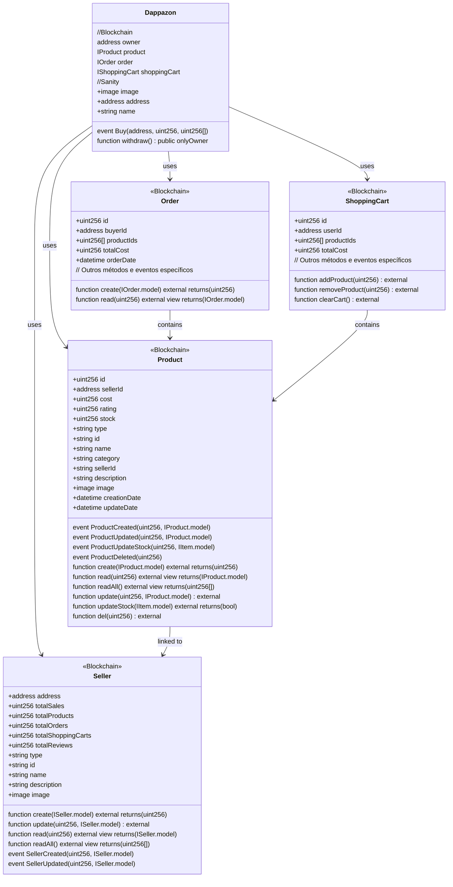

Me ajude a criar um diagrama em mermaid:

class Dappazon{
    //Blockchain
    constructor(address _productAddress,
                address _orderAddress,
                address _shoppingCartAddress) {

        owner = msg.sender;
        product = Product(_productAddress);
        order = Order(_orderAddress);
        shoppingCart = ShoppingCart(_shoppingCartAddress);
    }

    address public owner;
    IProduct public product;
    IOrder public order;
    IShoppingCart public shoppingCart;

    event Buy(address buyer, uint256 orderId, uint256[] productIds);

    function withdraw() public onlyOwner;

    //Sanity
    +image image
    +address address // O FE irá ler essa informacao para se conectar ao Smart Contract
    +string name
}

class Product{

//Blockchain
+uint256 id;
+address sellerId;
+uint256 cost;
+uint256 rating;
+uint256 stock;

//Event
event ProductCreated(uint256 id, IProduct.model product);
event ProductUpdated(uint256 id, IProduct.model product);
event ProductUpdateStock(uint256 stock, IItem.model shoppingCartProducts);
event ProductDeleted(uint256 id);

//Methods: Blockchain
function create(IProduct.model memory _product) external returns (uint256);
function read(uint256 _id) external view returns (IProduct.model memory);
function readAll() external view returns (uint256[] memory);
function update(uint256 _id, IProduct.model memory _product) external;
function updateStock(IItem.model memory _shoppingCartProducts) external returns (bool);
function del(uint256 _id) external;

//Sanity
+string type
+string id
+string name
+string category
+string category
+string sellerId
+string description
+image image
+datetime creationDate
+datetime updateDate

}

class Seller{

//Blockchain
+address address;
+uint256 totalSales;
+uint256 totalProducts;
+uint256 totalOrders;
+uint256 totalShoppingCarts;
+uint256 totalReviews;

//Methods: Blockchain
function create(ISeller.model memory _seller) external returns (uint256);
function update(uint256 _id, ISeller.model memory _product) external;
function read(uint256 _id) external view returns (ISeller.model memory);
function readAll() external view returns (uint256[] memory);

//Event: Blockchain
event SellerCreated(uint256 id, ISeller.model seller);
event SellerUpdated(uint256 id, ISeller.model seller);

//Sanity
+string type
+string id //Mesmo id da blockchain
+string name
+string description
+image image

}

class Order{

//Blockchain

}

----

